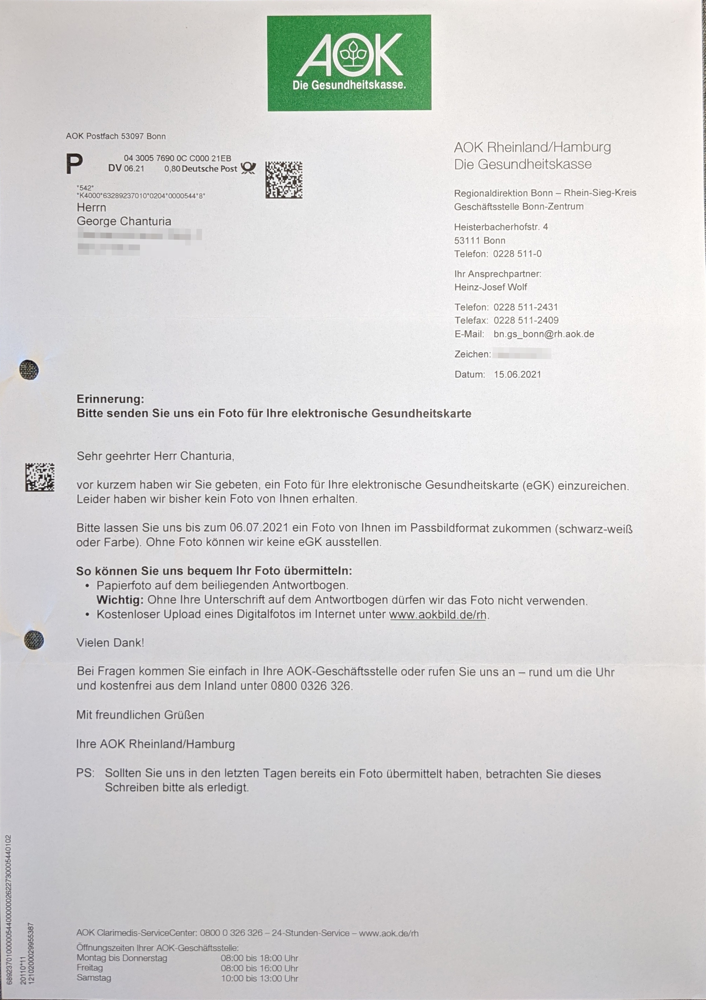
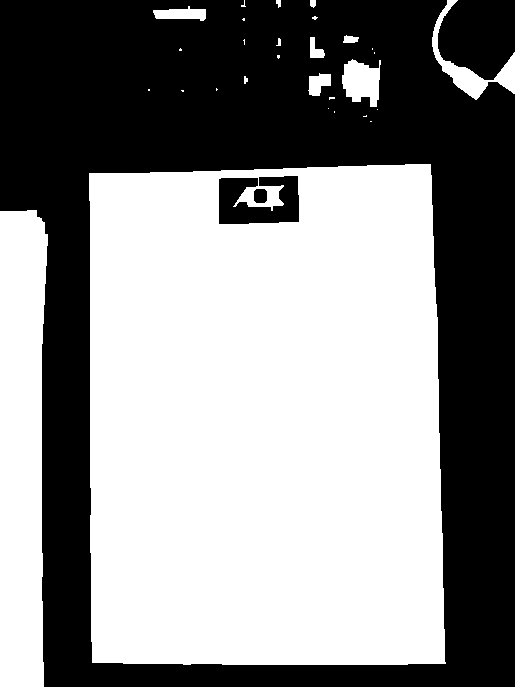
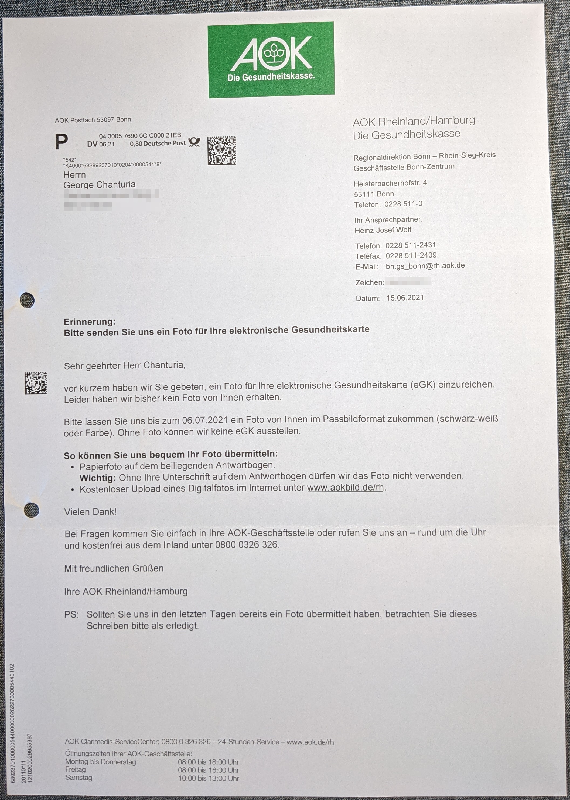
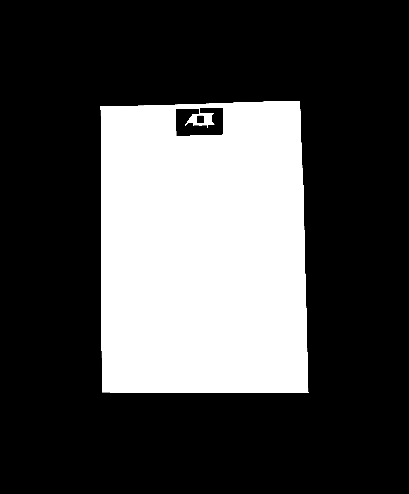
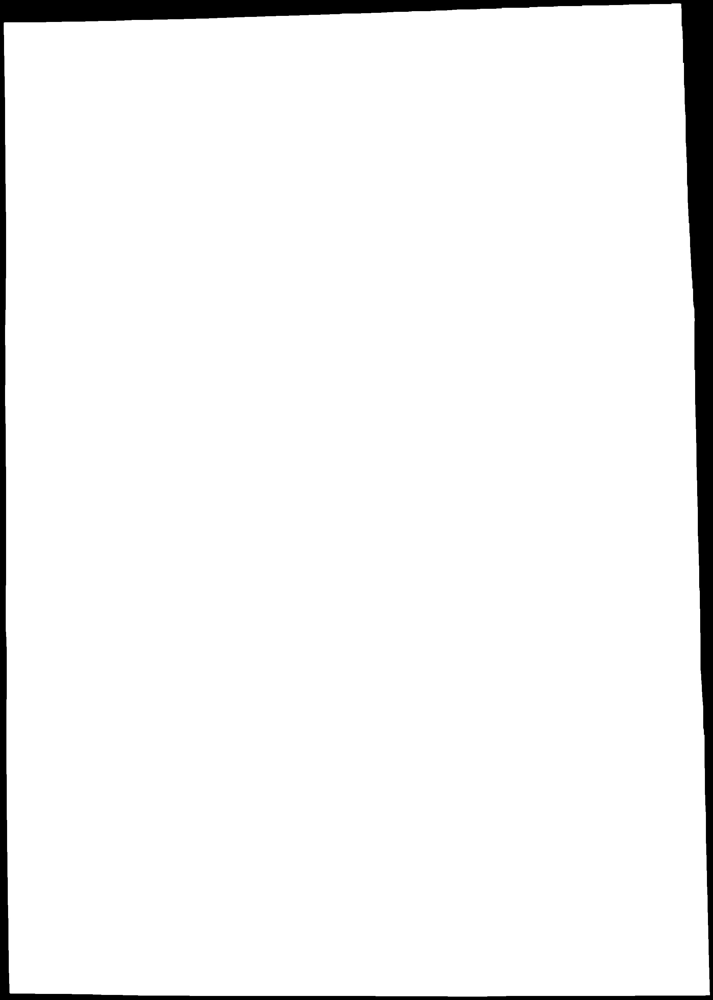
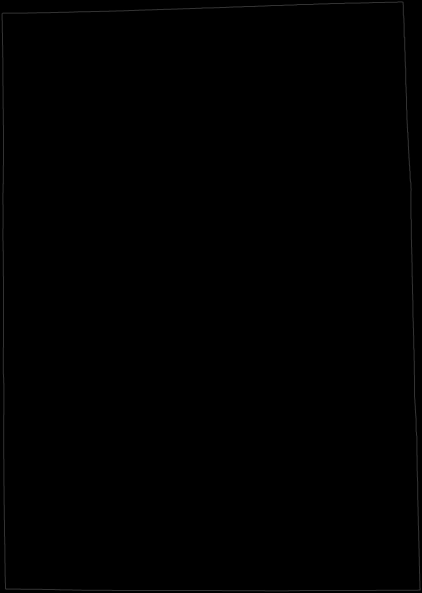
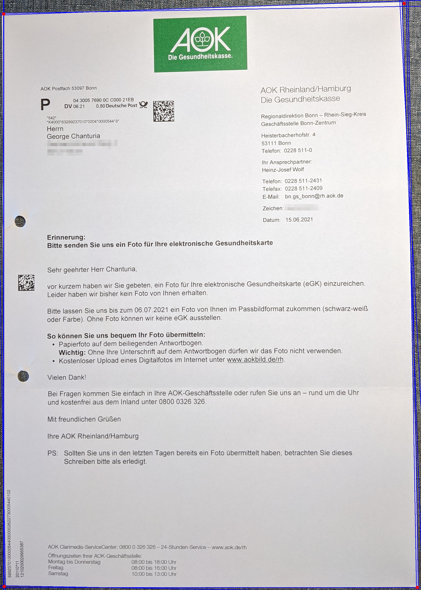

# Crop a document

I have a lot of documents lying around. The dream is to digitise them all and get rid of the paper piles. The sheer amount, though, makes this very intimidating.

This project is the first step towards the long journey of organising documents.

## The problem and the solution

I am not pretending that the bicycle does not exist here. There are many scanner apps available. The problem is that they always come short in at least one direction: some are slow, some inaccurate, some cannot handle many documents at once, some compress the files too much, etc.

The goal is to **take photos with a phone** (or anything, really, as long as we are not left at the mercy of a copier), **detect the document**, and **crop the photo to content**.

| Input    | Output  |
| -------- | ------- |
|   |  |

I have deliberately selected a setting where the object is not completely isolated. You can see parts of another document, my keyboard, some cables, etc. The important criteria for this algorithm is that the document is the **largest white (light) shape on a dark background**.

The first step is to remove some of the details. This can be done by morphological transformations: opening and closing (read more [here](https://docs.opencv.org/4.11.0/d9/d61/tutorial_py_morphological_ops.html)). To perform these operations, we need to define *kernels*. The bigger the kernel, the bigger details it removes, but we need to be careful, since there are some features we want to keep (like the overall shape of the document). This is why I define three different sizes:

```python
kernel = np.ones((7,7),np.uint8)
kernel_bigger = np.ones((50,50),np.uint8)
kernel_even_bigger = np.ones((5,900),np.uint8)
```

We first convert our image to grayscale, run the threshold filter (this maps every point to either black or white, depending on its current value), and perform consecutive morphological transformations:

| Small kernel    | Large kernel  |
| -------- | ------- |
|   |  |

> **Caution!** If there is not enough space around the document, the borders opening with a bigger kernel will push it to the boundary of the image. This is why in my code I only perform closing with a bigger kernel. But if we want to circumvent this problem, there is a way: adding a dark padding around the photo. You will see such an operation below.

After this, we can look for contours and choose the biggest bounding box.

| Largest bounding box (green)    | Cropped image  |
| -------- | ------- |
|   |  |

If you want, you can call this a day, but there is one more step we can do: perspective warping. For that, we need corners. Before we continue, though, we have one large detail to take care of (the logo on top). For that our medium-sized kernel was not enough, however, the bigger kernels will distort the overall shape of the document. Time to do the trick mentioned above: add some dark padding before the convolution and remove it afterward.

| Extra dark padding    | Largest kernel convolution  |
| -------- | ------- |
|   |  |

After this, we detect the edges using Canny's algorithm and turn them to lines using Hough transform.

| Canny edge detection   | Hough lines  |
| -------- | ------- |
|   |  |

Since the edges of the document are not perfectly straight, we end up with multiple Hough lines. We can find all intersections (through away the ones if the intersecting angle is not close to 90 degrees), cluster them using k-means and define corners as the geometric centres of these clusters.

After we have the corners, we map them to corners of an A4 paper in 300 DPI.

| Corners from clusters   | Perspective cropping  |
| -------- | ------- |
|   |  |


## Possible extensions

- [ ] The current code assumes that we are working with a document of size A4. This can be generalised to other common paper sizes or (more advanced) we can come up with an algorithm to detect an approximate aspect ratio.
- [ ] Big dark details on the documents are still at the mercy of convolution with large kernels. This will not work efficiently if there is a dark vertical (or horizontal) line going all across the document. This cannot be dealt with by morphological transformations. A possible solution is to throw away some Hough lines which run through the document.
- [ ] The whole script can be made more memory-efficient (by overwriting some intermediate images) and faster (by avoiding convolution if the details can be cleaned otherwise).

## Next steps

The output image is ready for OCR (Optical Character Recognition) and some color-correction (such as brightness and contrast) in order to make it more readable.